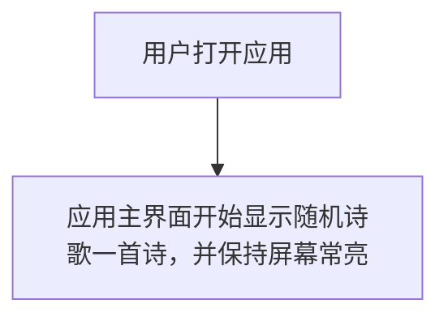
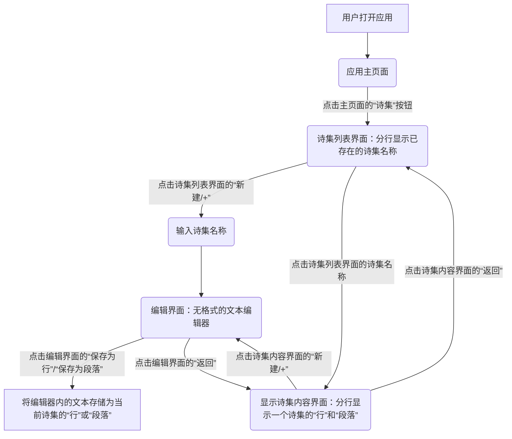
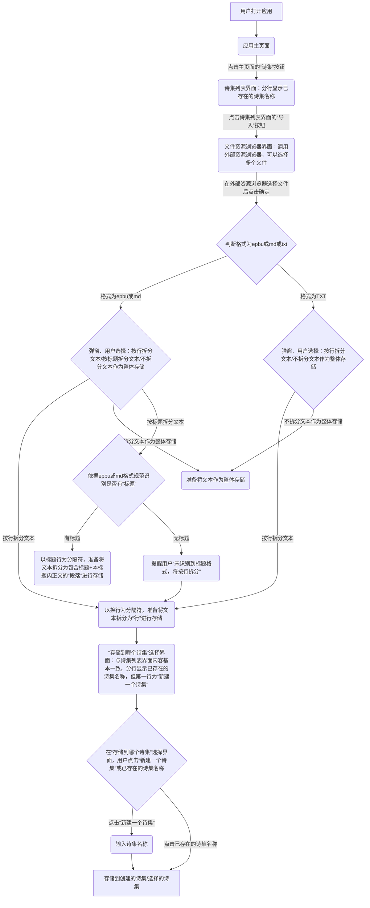
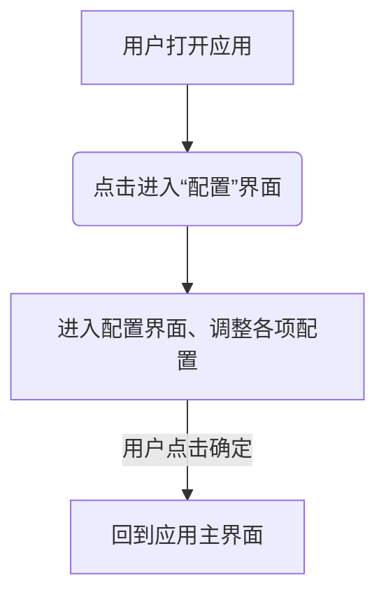

# 随机诗歌屏幕（Random Poetry Screen）产品需求文档 Product requirement document
## 1. 需求概述
### 产品概述及目标
随机诗歌屏幕（Random Poetry Screen）是一个基于安卓移动端的随机生成/随机显示诗歌的应用。
应用的核心价值是：当用户希望克制自己使用手机时，以上述形式占据用户手机屏幕，在用户不自觉地想要使用手机娱乐时，给用户的注意力和操作一个缓冲窗口、缓冲事件，给人留出调起自身的意识、意志力、主动察觉的机会。
### 运营环境
本应用完全在安卓移动端本地运行，功能由使用人自主配置、管理。

## 2. 产品描述
这是一个纯本地、无服务端的安卓原生应用。用户打开应用时，应用将以优良的Decryption Effect风格随机显示一首诗歌。这首诗歌可以是一首以“段落”类型存储在本地的、已经完成的诗歌，也可以是随机将多个“行”、“段落”随机拼凑成的诗歌。用户可以创建“诗集”，并在诗集中编写无格式文本，存储为“行”或“段落”，作为随机显示诗歌的源数据。创建诗集界面，支持用户导入epbu格式或.md格式或.txt格式的诗歌/诗集文本。支持用户调整显示时间间隔、显示速度、诗歌行数、随机显示范围、诗歌生成方式、时间显示等配置。
### 名词解释
**Decryption Effect风格**：一种前端文本动画风格。首先确定文本占用的面积（字符大小、字符间距、字符数、行距等），并用随机字符占用这些面积，这些随机字符会不断变换闪烁；随后从第一个字符开始，以显示速度显示文本，直到最后一个字符显示完成。最终呈现为一种“解密”的效果，给用户一种“发现”的感觉。
**段落**：应用中定义的一种数据存储类型，包含多个行的文本，具有“行数”属性；
**行**：应用中定义的一种数据存储类型，包含1行文本，“行数”属性固定为1；
**诗集**：一些段落和行的集合，用于分类管理段落和行，每个诗集都有一个唯一的名称，同时也是主界面生成诗歌的源数据；
**显示时间间隔**：主界面显示一个诗歌后，到开始显示下一个诗歌前，中间的时间间隔，单位为秒；
**显示速度**：Decryption Effect风格的显示速度，单位为毫秒/字符；
**诗歌行数**：随机生成的诗歌的行数，是一个包含2个int值、表示闭区间范围值的数组，左边界最小为1，右边界最大为99；
**随机显示范围**：用户配置的随机生成诗歌的数据源范围，可以选择1个或多个诗集；
**诗歌生成方式**：用户配置的诗歌生成方式，包括随机显示1个段落、随机组合行、随机组合段落和行。
**时间显示**：界面上显示哪种时间，可以选择：刷新倒计时、应用运行时间、番茄钟倒计时、实时时间
### 产品整体流程图
1. 主要流程：

2. 编辑流程：

3. 导入流程：

4. 配置流程

### 功能清单
1. 管理诗集
2. 编辑文本
3. 导入文本、自动切分、处理后文本存入诗集
4. 主界面屏幕常亮、不息屏，显示随机诗歌和时间

## 3. 功能需求
1. 管理诗集
    1. 用户可以在诗集界面，查看已存在的诗集；
    2. 用户可以新建诗集，在命名完成新建诗集后自动进入文本编辑界面；
    3. 用户可以重命名、删除诗集；
    4. 用户可以将多个诗集合并，并命名合并后的诗集，合并后，之前的诗集自动删除；
    5. 用户可以将所有诗集导出为一个应用自定义文件后缀格式（暂定为.rdpoem，本质是xml或json，由开发者决定）的文件，这个文件包含用户本地所有的诗集、行、段落数据，用于在不同设备间导入
    6. 用户可以在诗集界面，点击“导入”按钮，选择一个.rdpoem文件，应用会自动将文件中的诗集、行、段落数据导入到应用中；

2. 编辑文本
    黑底、像素风格的文本编辑器，用户可以在编辑器内编辑文本、查找文本、替换文本；
    可以快捷复制编辑器内容到剪贴板；
    
3. 导入文本、自动切分、处理后文本存入诗集
    1. 用户可以在诗集界面，点击“导入”按钮，调用系统的资源管理器导入多个epbu文件、md文件、txt文件
    2. 导入后弹出选择窗口，对epbu文件、md文件，用户可以选择A按行拆分文本/B按标题拆分文本/C不拆分文本作为整体存储；对txt文件，用户可以选择A按行拆分文本/C不拆分文本作为整体存储
    3. 按行拆分：以换行为分隔符，将文本拆分为“行”进行存储；
    4. 按标题拆分：依据epbu或md格式规范识别是否有“标题”；
        1. 存在标题时，再判断一级标题和二级标题数量；存在0或1个一级标题、多个二级标题时，以二级标题为分隔符，将文本拆分为多个“段落”进行存储；存在多个一级标题时，以一级标题为分隔符，将文本拆分为多个“段落”进行存储；
        2. 不存在标题时，提醒用户“未识别到标题格式，将按行拆分”，以换行为分隔符，将文本拆分为“行”进行存储
    5. 不拆分文本作为整体存储：将整个文本作为“段落”存储，不进行拆分
    6. 用户在弹出的选择窗口选择确认后，在存储界面，用户可以选择存储到已有诗集或直接新建一个诗集，应用会自动将文本存储到用户指定的诗集中；
    
4. 主界面屏幕常亮、不息屏，显示随机诗歌和时间
    1. 诗歌的显示效果：采用Decryption Effect风格以强调“随机生成”、突出命运感。字符大小，字符间距，行距为由应用根据屏幕分辨率动态调整，确保在不同屏幕尺寸下都能正常显示，不需要用户配置。字体为应用默认的像素风格，界面色彩和美术风格为极客风。预留扩展空间，后续可以根据需求添加其他显示效果。
    2. 诗歌的随机生成方式，在配置中，用户可以选择随机段落、随机组合行、 随机组合段落和行3种类型：
        1. 随机段落：在用户配置的诗集范围内，随机显示1个“段落”
        2. 随机组合行：在用户配置的诗集范围内，随机组合诗集中多个“行”，行数在用户配置的“诗歌行数”内随机；
        3. 随机组合段落和行：在用户配置的诗集范围内，随机组合多个”行“和“段落”，此时，行与段落的总行数在大致符合用户配置的“诗歌行数”范围，但不要求严格符合。（随机算法暂定如下，最终由开发人员决定：首先在用户配置的“诗歌行数”范围内随机确定一个行数sum_r；在诗集范围内统计确定”段落“类型的行数的众数p_mode，记p_num = int(sum_r / p_mode)；随机取[0, p_num]个”段落“, 如果取出的段落行数和小于sum_r，那么就随机取”行“补齐，然后用上述”段落“和”行“组成随机诗歌；如果如果取出的段落行数和不小于sum_r，那么即用取出的段落组成随机诗歌）
    3. 显示时间：主界面的角落以像素风格显示时间，在配置中，用户可以选择刷新倒计时、应用运行时间、番茄钟倒计时、实时时间4种类型的时间

5. 用户配置
用户可以在配置界面进行以下配置：
    1. **显示时间间隔**：设置主界面显示一个诗歌后，到开始显示下一个诗歌前的时间间隔，单位为秒；
    2. **显示速度**：设置Decryption Effect风格的显示速度，单位为毫秒/字符；
    3. **诗歌行数**：设置随机生成的诗歌的行数范围，为包含2个int值的闭区间数组，左边界最小为1，右边界最大为99；
    4. **随机显示范围**：选择随机生成诗歌的数据源范围，可以选择1个或多个诗集；
    5. **诗歌生成方式**：选择诗歌生成方式，包括随机显示1个段落、随机组合行、随机组合段落和行；
    6. **时间显示**：选择界面上显示的时间类型，可选刷新倒计时、应用运行时间、番茄钟倒计时、实时时间。
        

## 4. 非功能需求
尽可能少使用系统权限、少获取用户信息
整体界面为黑底、像素风格，界面色彩和美术风格为极客风。

## 需求更新-2026-07-08

### 文本显示优化
1. 当前版本，主界面显示文本时左对齐、上下居中。优化为：左右居中、上下居中；
2. 当前版本，当主界面显示的文本行数超过屏幕高度时，超出屏幕的文本无法看到。优化为：提前计算/处理文本的显示面积，当计算得出文本显示面积超过主界面屏幕高度时（提前计算/处理文本显示效果时，注意要涵盖文本自动换行的情况），将文本分块、分别渲染。即：当前屏幕上可见的文本Decryption Effect动画运行完毕后，停留**显示时间间隔**，然后向上滚动至屏幕外，下一部分文本的加密占位字符随滚动完全进入屏幕可见部分后，开始执行Decryption Effect动画；按此循环直至当前的随机文本全部显示完成，再进入下一个生成、显示随机文本的流程。
3. 当前版本，文本中有空格时，空格本身不会带Decryption Effect动画效果，使得以空格区分单词的英文文本，在Decryption Effect动画完成前，就通过占位字符提前”透露“了单词数量和长度。优化在看起来像逐个单次

### UI优化
1. 当前版本，主界面的”配置“按钮和”诗集“按钮存在感太强，本应用是一个”屏幕“应用，主界面应尽量纯净。优化：通过调整按钮UI透明度，或点击唤出等方式，降低按钮存在感
2. 除黑底绿字外，增加其他几种配色风格（黑底白字等）供用户选择
3. 如有UI静态资源，如字体、图片，开发者可以在/Documents文件夹中编写文档，说明需求的文件名、用途、格式、柜格、存放位置。在下一次更新时，美工将会把资源放在文档指定位置

### 数据管理优化
1. 当前版本删除诗集时，关联的行和段落数据清理机制需要完善，确保数据一致性
2. 增加数据完整性校验机制，防止数据文件损坏导致应用崩溃
3. 添加数据导出为通用格式（TXT/Markdown）的功能，方便用户备份和分享

### 用户体验优化
1. 编辑界面添加文本字数统计，帮助用户了解当前编辑内容的规模
2. 导入功能添加文件大小限制和导入进度反馈，提升大文件导入体验
3. 在诗集内容界面添加文本搜索功能，方便快速定位特定内容
4. 添加操作确认弹窗（如删除诗集、清空内容等），防止误操作

### 功能完善
1. 当前EPUB格式导入功能未完整实现，需要完善二进制解析逻辑，支持EPUB文件的正文提取和拆分
2. 添加文本预览功能，在编辑界面可预览Decryption Effect效果
3. 增加显示效果配置，如字符动画速度变化、闪烁频率等参数

### 性能优化
1. 优化JSON序列化/反序列化性能，考虑使用kotlinx.serialization替代Gson以提升大数据量处理效率
2. 添加数据加载缓存机制，减少重复IO操作
3. 优化Decryption Effect动画性能，确保在低端设备上流畅运行

### 需求更新-2026-07-15

#### UI用户可读性优化
1. 诗集界面的拆分方式选项文字优化："按行拆分"改为"这是拼贴诗素材"，"按标题拆分"改为"这是一本诗集"，"不拆分(整体存储)"改为"这是一首诗"

#### 数据更新
1. 默认诗集数据从100条扩展为全部1189条诗歌素材，确保用户首次使用时有丰富的诗歌内容

#### UI配色优化
1. 诗集界面字体颜色和UI元素跟随配色风格变化，不再使用硬编码颜色

#### UI交互优化
1. 诗集界面导入按钮拆分为两个："导入txt文件"和"导入md文件"，简化操作流程
2. txt文件默认按行拆分（BY_LINE模式），md文件默认按标题拆分（BY_TITLE模式）
3. 移除拆分方式选择对话框，根据文件类型自动确定拆分模式

#### 主界面优化
1. 主界面按钮（诗集、设置）默认隐藏，点击屏幕唤出，再次点击隐藏
2. 添加状态栏padding，防止按钮与顶部状态栏重叠